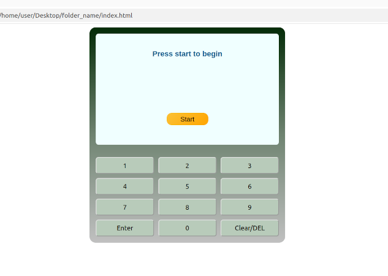

## Simple Cash Machine

### Project Description

This simple web-based Cash Machine program performs mock balance operations at a user's choice, using web interface prompts to interact with the user.

 *List of operations available:*
 * **PIN validation** - checks if the length of the provided PIN is equal to 4 digits; 
 * **check** - for checking balance;
 * **deposit** - for depositing money;
 * **withdraw** - for withdrawing money.

 The **initial balance** is £2000.

### How to run
Download *CashMachine.js, index.html* and *style.css* files from this repository.
Open the *index.html* file in your web browser by following these steps:
```
1. right click on the "index.html" file;
2. in a pop-up menu select "open with Name-Of-Your-Browser"
```
As a result, in the browser window that opens, you must see the "Cash Machine" web interface:


To begin, just click the shiny orange "Start" button on the screen.
After that, all you need to do is follow the prompts on the "Cash Machine" display!

> [!NOTE]
> To successfully run "Cash Machine" program, keep all files of this package in the same directory.


### Command input requirements

During **PIN validation**, enter digits exactly as prompted, otherwise an error will appear. For example:
```
Please, enter your PIN (4 digits)
```
It means that your PIN must be exactly 4 digits long, a longer or shorter PIN won't be accepted. For example, if the PIN provided is longer than 4 digits, the following error will appear:
```
Error: your PIN is too long. 4 attempts left
```
For **Deposit** and **Withdraw** operations, where numbers are required, the amount entering must be greater than £0, otherwise the error will occur. For example:
```
Error: the deposit amount is £0
```

For **Deposit** operations, there is a maximum amount of deposit, which is £999999. In the case you enter a larger amount, you'll see the error on the display:
```
Error: the deposit amount is too large
```
During **Withdraw** operations, the amount entered must be equal or less than your current balance to avoid the following error:
```
Error: the amount exceeds the balance
``` 


### Requirements

* Installed and recently updated one of the popular web browsers such as Chrome, Edge, Safari, Firefox, Opera (except Opera Mini), etc.
